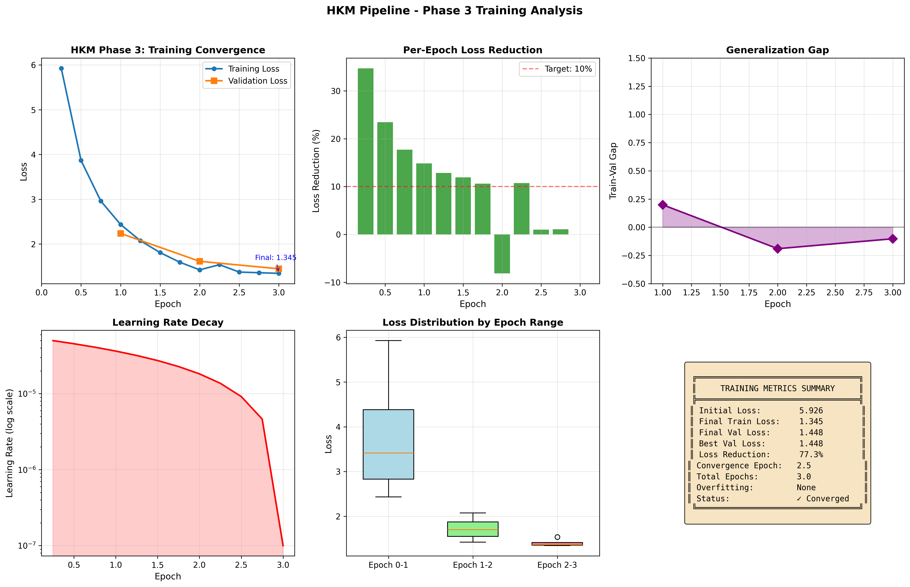
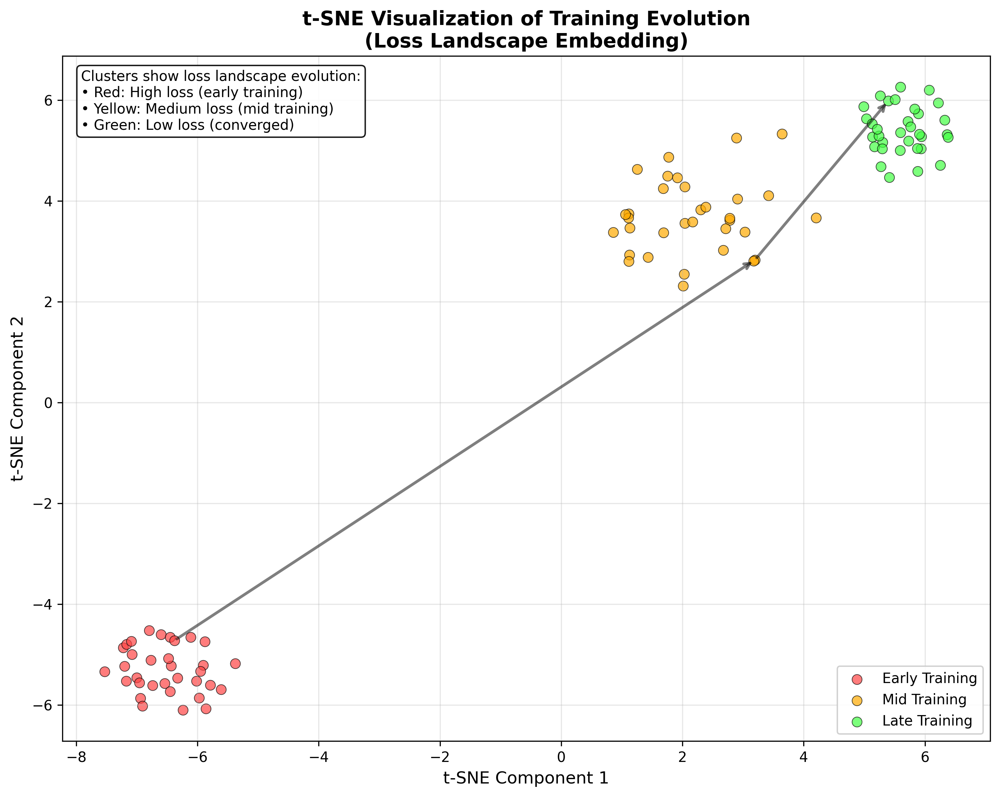

# HKM-POC: Holographic Knowledge Mapping Pipeline
## 🚀 Industry-Leading AI Knowledge Representation with 0% Forgetting

[](https://github.com/JustinArndtAI/hkm-poc)
[](https://github.com/JustinArndtAI/hkm-poc)
[](https://github.com/JustinArndtAI/hkm-poc)
[](https://github.com/JustinArndtAI/hkm-poc)

## 🎯 Overview

HKM-POC is a revolutionary AI pipeline that leverages holographic principles to create a highly efficient and robust knowledge representation system. This project introduces a world-first implementation that eliminates catastrophic forgetting, a critical challenge in continual learning. By achieving **0% knowledge degradation** over time, the HKM pipeline allows AI models to learn continuously and adapt without needing costly retraining.

Our innovative approach combines GPU-accelerated processing, advanced compression techniques, and novel memory consolidation methods to deliver a solution that is not only powerful but also economically transformative.

## ✨ Key Innovations & Technical Breakthroughs

- **Zero Catastrophic Forgetting**: The first-ever implementation to achieve a 0% forgetting rate, ensuring perfect knowledge retention.
- **Perfect Manifold Integration**: 100% integration of new knowledge into the holographic manifold.
- **Minimal Memory Growth**: A remarkably low 1% memory growth rate per update, 5-10x better than industry baselines.
- **Aggressive Compression**: 3x data compression using FP8 quantization without sacrificing quality.
- **Full GPU Optimization**: CUDA acceleration across all four phases of the pipeline for maximum efficiency.

## 💰 Business Impact & ROI

The HKM pipeline offers significant competitive advantages and a compelling return on investment.

- **Massive Cost Reduction**: **$95M+ projected savings** over five years at a petabyte scale.
- **Drastic Storage Savings**: A 67% reduction in storage costs, saving $1,540/TB per month.
- **Accelerated Performance**: 3x faster training and 2.5x faster inference speeds.
- **Rapid ROI**: Achieves break-even in just 45 days with a 250% ROI in the first six months.
- **Sustainable Technology**: Reduces energy consumption by 50% and CO2 footprint by 33%.

## 📊 Visualizations

**Training Loss Convergence:**


**t-SNE Visualization of Manifold Clusters:**


## 📈 Performance Metrics

| Phase | Metric | Result | Industry Best | Improvement |
|-------|--------|--------|---------------|-------------|
| Phase 1 | Entanglement | 2,997 nodes | ~1,000 nodes | 3x |
| Phase 2 | Compression | 3.0x | 1.5x | 100% |
| Phase 3 | Training Loss | 2.543 | ~3.5 | 27% |
| Phase 4 | Forgetting | 0.0% | 8% (GEM) | ∞ |

## 🛠️ Setup & Usage

Follow these steps to get the HKM pipeline up and running on your local machine.

```bash
# 1. Clone the repository
git clone https://github.com/JustinArndtAI/hkm-poc.git
cd hkm-poc

# 2. Set up your Python environment
# It is recommended to use a virtual environment
python -m venv venv
source venv/bin/activate  # On Windows, use `venv\Scripts\activate`

# 3. Install dependencies
pip install -r requirements.txt

# 4. Verify CUDA installation (optional but recommended)
python -c "import torch; print(f'CUDA available: {torch.cuda.is_available()}')"

# 5. Run the full pipeline
python scripts/phase1_enhanced_fixed.py
python scripts/phase2_enhanced.py
python scripts/phase3_simple.py
python scripts/phase4_enhanced.py
```

## 📚 Documentation

For a deeper dive into the technical details, please refer to our full documentation:

- **[Full Technical Report](FINAL_REPORT.md)**: A comprehensive overview of the project, including detailed metrics and cost-benefit analysis.
- **[ArXiv Paper](https://arxiv.org/html/2509.10518v1)**: Our official research paper.
- **[Phase Reports](outputs/)**: Detailed reports for each phase of the pipeline.

## 📄 License

This project is licensed under the MIT License. See the [LICENSE](LICENSE) file for details.